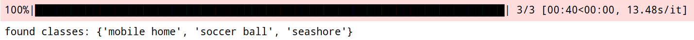
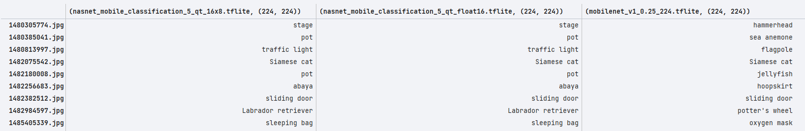
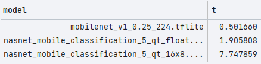
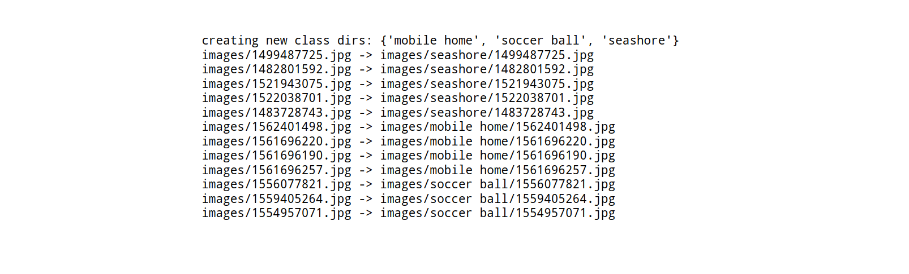

# QuantLabel

Quick dataset auto-labeling using quantized (PTQ) models in PyTorch, TensorFlow, and Keras

## Examples

### TensorFlow

`label-interactive.ipynb`

<br>

Given the file `keywords.txt`

```
seashore
mobile home
soccer ball
```

<br>


Models perform inference on the data inside `images/`.

<br>






<br>


Runtimes are shown below.

<br>




<br>


Final output is shown. Directories are created for each class that was found which match your keywords
in `keywords.txt`. Images are moved into their respective class-labeled directories.

<br>


